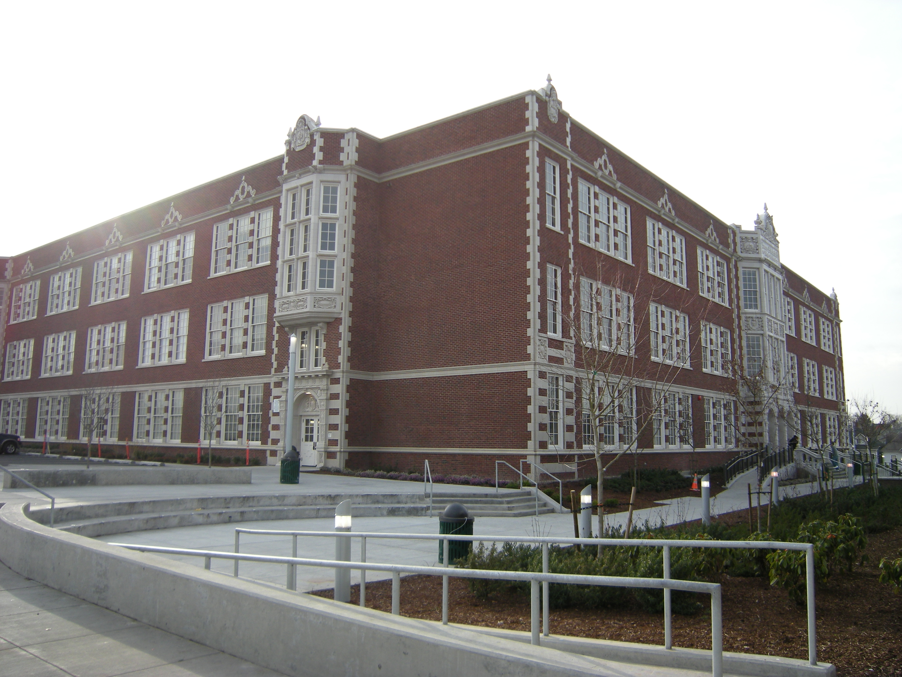
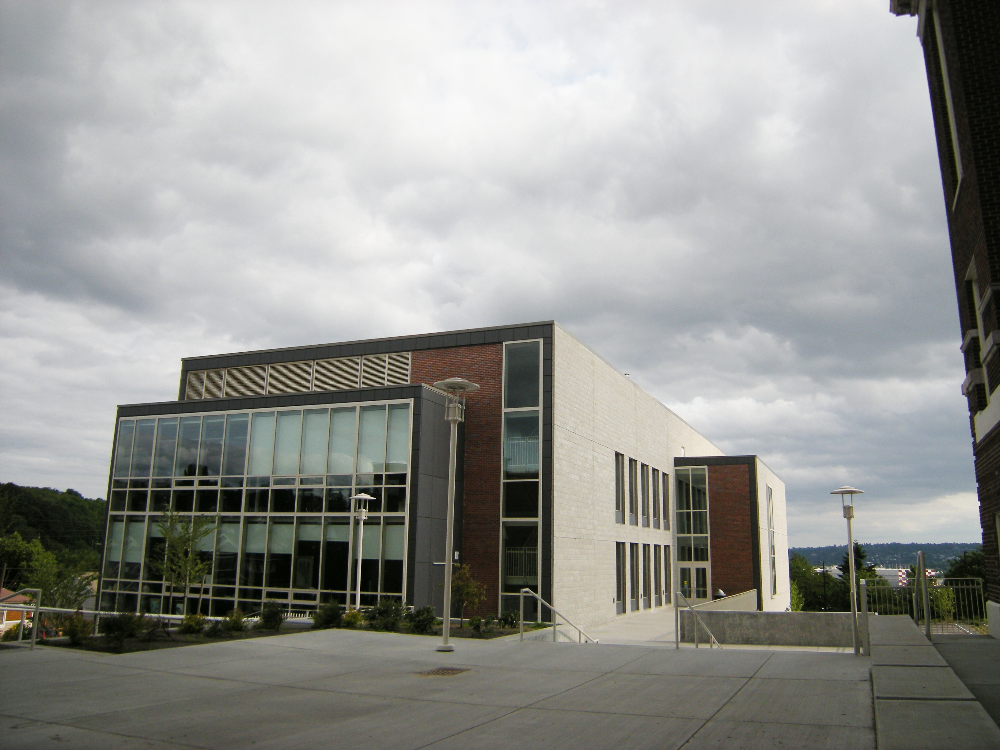
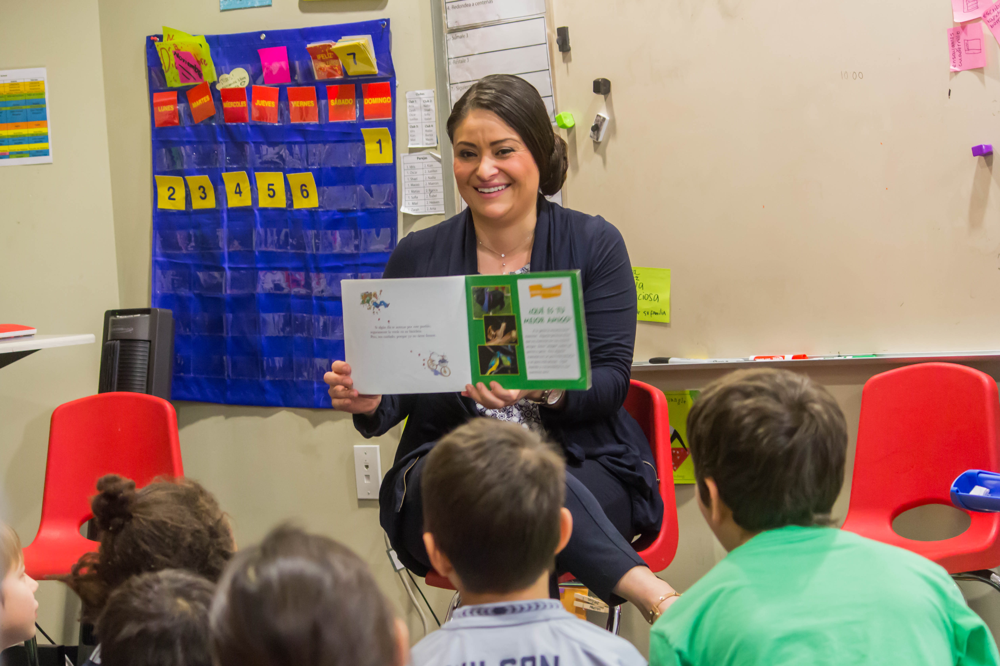
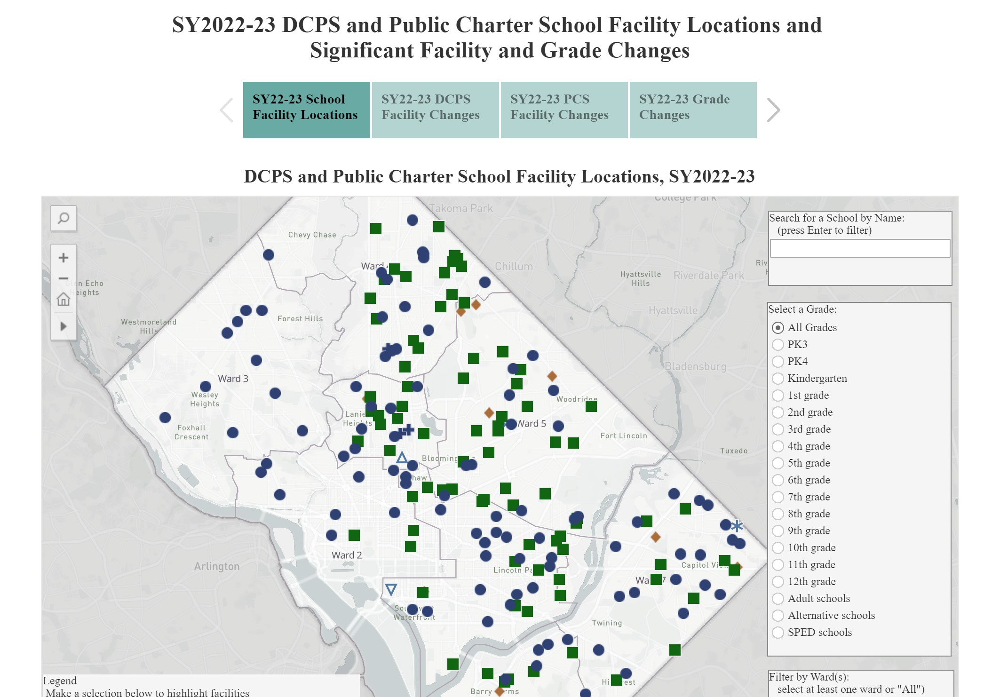
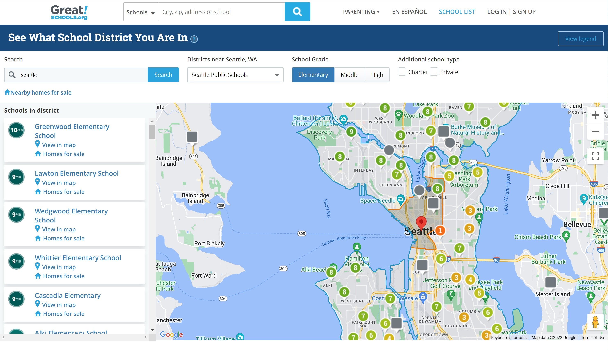
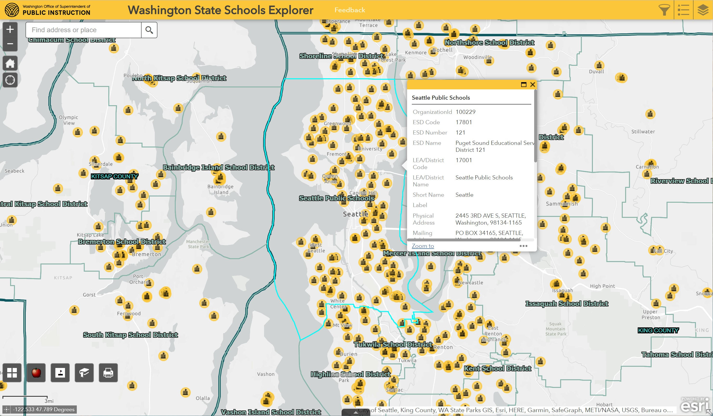
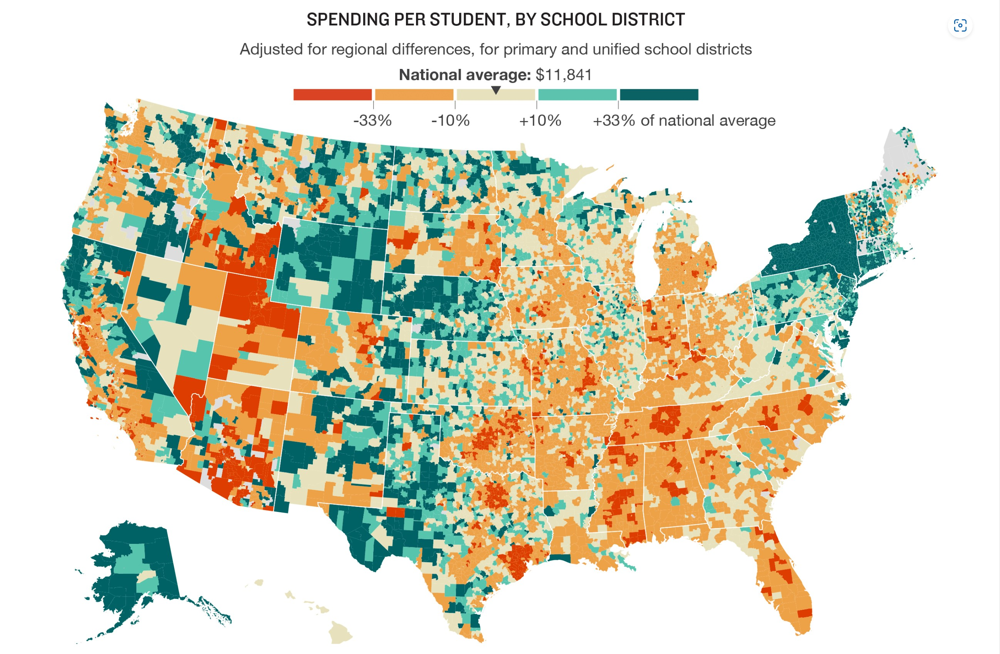

# Geography 495 Final Project - Mapping Education in Washington State

*Group BB2: Trang Ha, Weilin Wang, Elliot Schumacher, Maxwell Jayne*

* [**Education Mapping Website**](https://maxjayne-1860279.github.io/Geog495-EduMap/index.html)  
* [Data Preparation](https://maxjayne-1860279.github.io/Geog495-EduMap/DataPrep_updated.html)  
* [Proposal](https://github.com/maxjayne-1860279/Geog495-EduMap/blob/main/proposal.md)  
  
&emsp;The purpose of our project is to focus on education in Washington state. Education is a critical component of a child's development, providing them with the knowledge, skills, and opportunities they need to grow into successful and productive members of society. Unfortunately, not all children have access to the same level of education or educational resources equally, leading to disparities in educational opportunities and outcomes. 
  
&emsp;The site we created was a web-map of Washington schools and libraries using a geocoded search to identify schools near a provided address. It includes many features, the first of which is that the resulting schools would be presented in a sorted list based off the distance from the provided address. We created multiple layers, each layer pertaining to Washington’s library, elementary, middle, and high schools. This map contains multiple toggleable layers for additional analysis which allows the user to toggle school-level layers with a radial button. Our map can help assist families who are interested in knowing which schools their children may attend, and we also allow the option to filter schools by grade level (elementary, middle, or high school). It makes the research for schools easier overall since we also provide crucial information about each school. Overall, our map provides an informative visualization to show the distribution of libraries and schools throughout Washington state. The reason why we picked the state of Washington was for personal reasons. We all reside in Washington, and it would be useful for us to use this map in the future when we possibly have kids for ourselves.   
 
&emsp;There are two targeted audiences for our project. The main targeted audience for this project would be parents or prospective students searching for schools in a target area of Seattle, potentially in the process of home-buying or moving. Our secondary targeted audience could be state policymakers making decisions on where to invest in education; For instance, by displaying which counties may have less schools, libraries or schools of a certain grade level. By using our web-map, it can help policymakers identify which areas are lacking in numbers of schools or libraries. According to National Public Radio, lack of money for schools is a problem throughout the United States. Fundings from state to state, and/or district to district varies tremendously depending on the wealth of the area. Providing an informative visualization to Washington State education officials could help shed light on areas that are under-resourced for educational opportunities. 

&emsp;The primary datasets we plan to use (linked below) are Washington State schools dataset, Washington libraries dataset, Washington school district bounds dataset, and Washington county boundary dataset. All these datasets came from Washington Geospatial Open Data Portal.

&emsp;The main functions of our website are our search function, sorted list, toggle function with a radial button, and a tooltip. The search function allows users to enter an address to see the libraries and schools around the address. Alongside the search function, there is also a sorted list on the side based on the distance that includes further information on the results of the search. The toggle function allows for the user to choose which grade level they want to display on the map; they can choose a single, few, or all grade level. They can also toggle off the library to just solely focus on the schools. The tooltip function is generated by clicking an info icon in the list on the side of the map. This would display valuable information such as phone numbers, email, and the school’s principal.   
 
&emsp;The applied libraries that we used were Mapbox gl js, Github, and Canva. We used Canva to create our icons to use for the library, elementary, middle, and high school in the map.   

&emsp;We want to acknowledge our wonderful teacher assistant, Steven Bao that helped answer our questions whenever we reached out. He went above and beyond to help us. We would also like to acknowledge our professor Zhao that taught and provided the materials that are needed to create our website. For non-human acknowledgment, we want to acknowledge the tutorials provided by Mapbox that helped us with certain things we were unsure of coding. There were written examples and videos we used to help create our coding.   

&emsp;Other thing for the viewers to know is that the school dataset had more than just the school levels for elementary, middle, and high schools. There were also schools that were preschool only, preschool to 12th grade, kindergarten to 12th grade, and a category listed as others. We decided not to include these categories to just solely focus on the main school levels most students are attending. The three school levels we have already are very clustered as is, let alone the addition of the other categories. For our sake and for the maps, we just excluded them from our project. Lastly, we hope you enjoy our website, and that it is easy for you to use and understand!    

### Datasets:  
* [WA schools](https://geo.wa.gov/datasets/k12wa::washington-state-public-schools/explore?location=47.284512%2C-120.802250%2C7.71)  
* [WA school districts](https://geo.wa.gov/datasets/k12wa::washington-school-district-boundaries/explore?location=47.236309%2C-120.912772%2C7.79)   
* [WA counties](https://geo.wa.gov/datasets/wadnr::wa-county-boundaries/explore?location=47.220720%2C-120.817600%2C7.60)  
* [WA libraries](https://geo.wa.gov/datasets/f62ef46873bd4a80a31e3e88eafa43eb_0/explore)  
  
### Multimedia
* [IMG - Garfield HS (Wikimedia Commons - Joe Mabel)](https://commons.wikimedia.org/wiki/File:Seattle_-_Garfield_High_School_03.jpg)  
  
  
* [IMG - Cleveland HS (Wikimedia Commons - Joe Mabel)](https://commons.wikimedia.org/wiki/File:Seattle_-_Cleveland_High_School_08A.jpg)  
  
  
* [IMG - Students learning (Wikimedia Commons - Seattle City Council)](https://commons.wikimedia.org/wiki/File:Amistad_School_Visit_(31401322123).jpg)  
  
  
* [IMG - Seattle public schools sign (Kiro7 News - Fair use TBD)](https://www.kiro7.com/news/local/seattle-public-schools-awarded-500-000-for-youth-safety-stopping-school-violence/999916371/)  
  
  
Additional photos of Seattle Schools can be taken in person for project use
  
### Related Projects
* [2022-23 DC public schools interactive map](https://dme.dc.gov/node/1614161)  
  
  
* [GreatSchools.org](https://www.greatschools.org/school-district-boundaries-map/)  
  
  
* [Washington state schools explorer](https://k12wa.maps.arcgis.com/apps/webappviewer/index.html?id=7db7e443cd5c4f36a8355bc55cfb04c4)  
  
  
* [NPR - spending per student](https://www.npr.org/2016/04/18/474256366/why-americas-schools-have-a-money-problem)  
  

